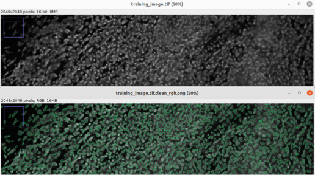

# pixel classification



This repo contains code to generate a make a binary classification decision
for pixels in 2D images.  Eventually C-code is generated for the classifier
and it is compiled into a mex file. The compiled classifier is about 50x
faster (single core) than the one built in to MATLAB in the few benchmarks
that I've performed.

This code is not written to be easy to use or useful for you, most likely
you would should use the excellent
[Ilastic](https://www.ilastik.org/).


## Contents

 - [Pixel Features](#features)
 - [Classifier](#classifier)
 - [Example usage](#example1)
 - [To Do](#todo)
 - [References](#references)


<a name="features" />

## Pixel Features
Just like Ilastic, features are extracted at multiple scales. The built
in features are:
 - Gaussian (1)
 - Laplacian of Gaussians (1)
 - Gradient magnitude (1)
 - Structure tensor eigenvalues (2)
 - Hessian eigenvalues (2)

For details see/edit `px_features_2d.m`.

<a name="classifier" />

## Classifier

Uses the class `TreeBagger` in MATLAB for classification. There is also `templateTree`/`fitensebmle`, see [this comparison](https://se.mathworks.com/help/stats/ensemble-algorithms.html#bsxabwd).

<a name="example1" />

## Example usage
The general procedure is something like this:
1. Choose a training image.
2. Create a copy of the training image and annotate it
   in your favorite drawing program. Use red and green to indicate
   background and objects.
3. Extract features from the labeled pixels in the training image
4. Build a random forest to classify the pixels.
5. Export the classifier as C-code.
6. Compile the classifier.
7. Use the classifier on other images.

Here is example code (in MATLAB) for classifying a single image:

``` MATLAB
image = 'image.tif';            % Image to classify
image_mask = 'image_mask.png';  % Annotated image
outFolder = 'test-classifier/'; % Where to store the results
mkdir(outFolder)

% Create binary masks for objects and background
mask = imread(image_mask);
bg = mask(:,:,1) > 200 & mask(:,:,3) < 50;
nuclei = mask(:,:,2) > 200 & mask(:,:,3) < 50;

% Read the image train on
I = df_readTif(image);

% Generate and train a random forest
px_gen_classifier(I, max(double(bg), 2*double(nuclei)), outFolder)

% Generate C-code and compile it into a mex file
model_to_c([outFolder 'Mdl.mat'])

% Apply it to the image
C = px_classify_image([outFolder 'Mdl.mat'], image);
C = double(C);
C = C/max(C(:));
imwrite(C, [outFolder 'classification.png'])
```

<a name="todo" />

# TODO
 - [ ] Parallelized classifier.
 - [ ] Generation of standard shared objects.
 - [ ] Improved logistics and usage in general.

## Files:
 - `px_interactive` -- interactively mark two classes in an image and then classify it.
 - `px_gen_classifier` -- generate a classifier from an image and a label image.
 - `px_classify_image` -- classify an image (by name) using a classifier/model generated by `px_gen_classifier`. This function processes the image in tiles (with some overlap) so that it doesn't consume too much memory.
 - `px_classify_region` -- classify a image matrix. Used by px_classify_image.
 - `mode_to_c.m` -- convert a TreeBagger model into a compiled mex function `cMdl`

 - `px_cleanup.m` -- Clean up classification results with watersheds etc.

 - `createComposite` -- merge channels and segmentation result.

<a name="references" />

# References
 - [Ilastic](https://www.ilastik.org/) A very user friendly program for 2D and 3D pixel classification. This is probably what you really want.
